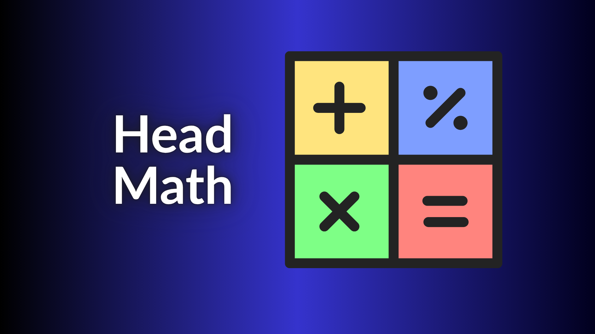

# Head Math

#### 1. What Is the Game?

**Head Math Pro** is a fast-paced browser-based mental arithmetic game designed to train calculation speed and accuracy. Players solve randomly generated **addition or subtraction problems** and try to achieve the highest possible score without making a mistake. The game combines mathematics with a timer, power-ups, visual effects, and a rank system to make repeated practice more engaging.

### 2. How to Play

Choose **Addition** or **Subtraction**.

1. For Addition, choose whether each problem contains **2, 3, or 4 numbers**.
2. Solve the displayed equation and enter the answer.
3. Press **Submit** or the **Enter** key.
4. A correct answer increases the score and generates a new question.
5. **One incorrect answer ends the game.**
6. Use power-ups when a problem is difficult.
7. Continue until you make a mistake, then check your final score, time, and rank.

### 3. Important Mechanics

#### Question Generation

Addition problems can contain 2–4 randomly generated numbers. The number generator is weighted toward smaller values, while subtraction generates two positive numbers and automatically places the larger number first to avoid negative answers.

#### Scoring

Every normal correct answer gives **1 point**. The game also tracks the number of correct answers and total playing time.

#### Power-Ups

There are three important power-ups:

- **Solve:** immediately provides the current answer.
- **Drop Digit:** removes a digit from a number, reducing the difficulty.
- **5x Score:** makes the next correct answer worth **5 points**.

Only **one power-up can be used per question**. Power-ups can also be restored after every five correct answers, with the restored type selected randomly.

#### Timer and Game Over

The game records total play time and monitors the time spent on each question. After **15 seconds** on a question, a hint encourages the player to use a power-up. A wrong answer triggers feedback and then ends the game.

#### Ranking System

The final score determines the player's rank:

| Score | Rank |
| --- | --- |
| 0–4 | Broken Math |
| 5–9 | Know Math |
| 10–19 | Basic Math |
| 20–49 | Abstract Math |
| 50–99 | Mega Math |
| 100–149 | Super Math |
| 150+ | Eternal Math |

These ranks provide long-term goals beyond simply completing individual questions.
