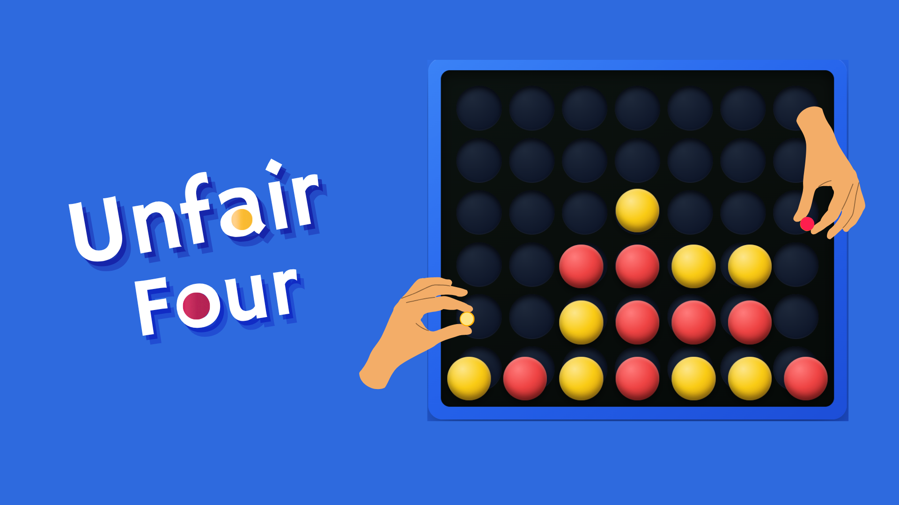

# Unfair Four

### 1. What Is the Game?

**Unfair Four** is a strategic **Connect Four-style game** played on a 7×6 board. Players take turns dropping discs into columns and try to connect four discs horizontally, vertically, or diagonally. Its main twist is a **one-time random skill event** that activates when the board reaches roughly 21–25 pieces, disrupting the normal rules and creating unexpected opportunities.

### 2. How to Play

You can choose either **Player vs Player** or **Player vs Computer:**

1. If playing against the computer, choose **Easy, Medium, Hard, or Extreme**.
2. Player 1 (red) always moves first.
3. Click/tap a column to drop a disc into its lowest available position.
4. Connect **four discs** horizontally, vertically, or diagonally to win.
5. Around the middle of the match, one random **Unfair Skill** activates.
6. If all 42 spaces are filled without a winning line, the match ends in a draw.

### 3. Important Mechanics

#### Unfair Skill System

The defining mechanic is a **single random skill per match**, triggered when approximately 21–25 pieces have been placed. Possible skills include:

- **Monochrome Mirage:** temporarily makes the pieces appear as one color.
- **Vanishing Act:** removes an opponent's piece and shifts the column.
- **Blockade:** prevents the opponent from using a selected column for their turn.
- **Infiltrator:** converts an opponent's piece to the current player's color.

#### Computer AI

The computer uses different strategies depending on difficulty. **Easy** chooses a random valid column, while Medium, Hard, and Extreme use **Minimax with alpha-beta pruning** at increasing search depths.

#### Board Evaluation

The AI evaluates the board by considering the center column and potential groups of four. It rewards its own two-, three-, and four-disc patterns while heavily penalizing situations where the opponent has an immediate three-in-a-row opportunity.
